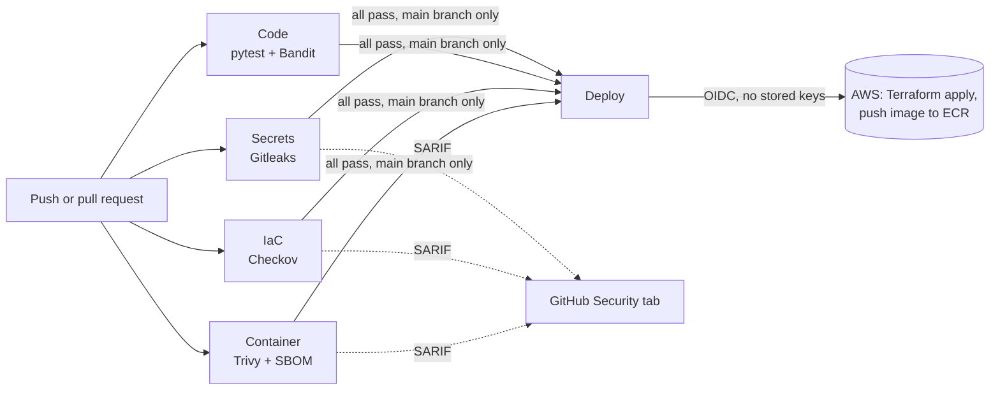

# DevSecOps Pipeline on GitHub Actions

A CI/CD pipeline where security is a gate, not an afterthought. Every push and pull request is scanned for leaked secrets, insecure code, infrastructure misconfigurations and vulnerable container images. Nothing reaches AWS unless every check passes, and deployment uses short-lived OIDC credentials, so no AWS keys are ever stored in GitHub.

## The problem it solves

Startups ship fast, and security review usually happens late or never. A leaked AWS key, a public S3 bucket in Terraform, or a base image with a critical CVE can go straight to production. This pipeline catches those automatically on every change, in minutes, at no extra cost.

## Pipeline



| Gate | Tool | Fails the build when |
|---|---|---|
| Secrets | Gitleaks | A credential appears anywhere in git history (full history is scanned, not just the last commit) |
| Code | pytest, Bandit | Tests fail, or Bandit finds a medium-or-higher issue such as shell injection |
| Infrastructure | Checkov | Terraform, the Dockerfile or the workflow itself is misconfigured |
| Container | Trivy | The image has a HIGH or CRITICAL vulnerability that has a fix available |
| Deploy | Terraform, ECR | Runs only on `main`, only after all gates pass, behind a `production` environment |

Findings from Gitleaks, Checkov and Trivy are uploaded as SARIF, so they appear in the repository's **Security > Code scanning** tab with file and line. An SBOM (CycloneDX) is attached to every run.

## Security built into the pipeline itself

- **OIDC instead of access keys.** GitHub gets temporary AWS credentials per run. The deploy role trusts only this repository's `main` branch.
- **Least-privilege tokens.** The workflow defaults to `contents: read`; each job asks only for what it needs.
- **Scoped deploy role.** It can manage one ECR repository and only KMS keys tagged for this project.
- **Hardened image.** Multi-stage build, slim base, non-root user (UID 10001), healthcheck, gunicorn instead of the Flask dev server.
- **Hardened registry.** ECR with immutable tags, scan on push, KMS encryption and a lifecycle policy.
- **Secure app defaults.** Security headers (CSP, HSTS, X-Frame-Options, nosniff) on every response.
- **Dependabot** keeps Python packages, the base image, GitHub Actions and Terraform providers up to date.
- **Pre-commit hooks** run the same scans locally before code is pushed.

## See it block a bad change

The [`demo/`](demo) folder holds intentionally insecure files: a public S3 bucket with SSH open to the world, a root-user Dockerfile on an outdated base image, and Python with shell injection. Copy one into place on a branch and open a pull request to watch the right gate fail. Instructions are in [`demo/README.md`](demo/README.md).

## Setup

**1. Use the scanning gates right away.** Push this repository to GitHub. The four scanning jobs run on every push with no configuration. The deploy job skips itself until AWS is configured.

**2. Optional: enable deployment to AWS.** Run the bootstrap once with admin credentials:

```bash
cd bootstrap
terraform init
terraform apply -var github_repo=YOUR-USER/devsecops-pipeline
```

Then in GitHub go to **Settings > Secrets and variables > Actions > Variables** and add:

| Variable | Value |
|---|---|
| `AWS_DEPLOY_ROLE_ARN` | `deploy_role_arn` output |
| `TF_STATE_BUCKET` | `state_bucket` output |
| `AWS_REGION` | for example `us-east-1` |

Create an environment named `production` under **Settings > Environments**. You can add required reviewers there for a manual approval step.

**3. Local checks.**

```bash
pip install pre-commit && pre-commit install
```

## Repository layout

```
.github/workflows/devsecops.yml   the pipeline
.github/dependabot.yml            automated dependency updates
.checkov.yaml                     IaC scan configuration
.pre-commit-config.yaml           local scans before commit
app/                              demo Flask API, Dockerfile, tests
infra/                            Terraform deployed by the pipeline (ECR)
bootstrap/                        one-time OIDC provider, deploy role, state bucket
demo/                             insecure examples to show the gates working
```

## Notes

- Code scanning (SARIF upload) is free on public repositories. Private repositories need GitHub Advanced Security; the gates still fail the build without it.
- For stricter supply-chain security, pin third-party actions to a full commit SHA instead of a version tag.

## Cost

The scanning jobs run on free GitHub-hosted runners. On AWS, the deployed resources cost about $1 per month (KMS key) plus ECR storage.

## License

MIT
